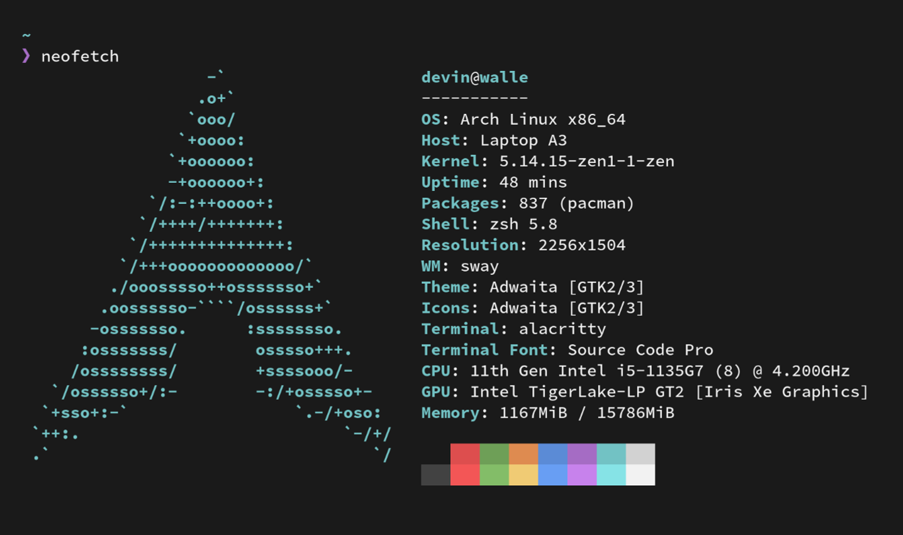

# Devin's Dotfiles

## File Structure / Explanation

This configuration is setup for sway, a tiling window manager for Wayland. All configs pertaining to sway can be found
in [.config/sway/config](./.config/sway/config)

For the top bar I used waybar, whose configs and associated scripts can be found in [.config/waybar](./.configy/waybar)

All styles associated with firefox can be found at [.mozilla/firefox/profile/chrome](./.mozilla/firefox/profile/chrome/)

My alacritty config can be found at [.config/alacritty/config](./.config/alacritty/config)

For visual studio code styles, check out [my fork of the material theme](https://github.com/DevinVS/vsc-material-theme).

All neovim configuration is done in [.config/nvim/init.vim](./.config/nvim/init.vim) and my vim theme is [my fork of the
material theme for vim](https://github.com/DevinVS/material.vim)

Associated scripts along with the portal script are found in [bin](./bin)
